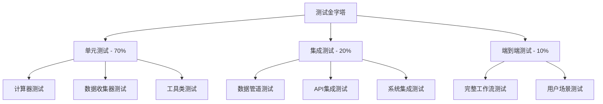

# 测试架构设计文档

## 测试架构概述

本设计文档描述了levAnalyzecc项目的测试架构，重点在于提升测试覆盖率而非建立自动化CI/CD流水线。

## 测试层次结构



## 测试分类策略

### 1. 单元测试 (Unit Tests)
**目标**: 验证单个组件的功能正确性
**覆盖率目标**: 85%+ 代码覆盖率

#### 核心计算器测试
```python
# 测试杠杆率计算器
class TestLeverageRatioCalculator:
    def test_calculate_leverage_ratio_basic()
    def test_calculate_leverage_ratio_edge_cases()
    def test_risk_level_assessment()
    def test_z_score_calculation()
    def test_trend_analysis()
    def test_data_validation()
```

#### 数据收集器测试
```python
# 测试FINRA数据收集器
class TestFINRACollector:
    def test_load_csv_data()
    def test_data_format_validation()
    def test_error_handling()
    def test_async_operations()
```

### 2. 集成测试 (Integration Tests)
**目标**: 验证组件间协作正确性
**重点**: 数据流和接口兼容性

#### 数据管道集成
```python
class TestDataPipeline:
    async def test_finra_to_calculator_pipeline()
    async def test_multi_source_data_merge()
    async def test_async_data_processing()
```

### 3. 数据质量测试 (Data Quality Tests)
**目标**: 确保数据的准确性和完整性

#### 数据完整性验证
```python
class TestDataQuality:
    def test_time_series_continuity()
    def test_data_range_validation()
    def test_missing_value_handling()
    def test_outlier_detection()
```

### 4. 精度测试 (Precision Tests)
**目标**: 验证计算公式的准确性

#### 计算精度验证
```python
class TestCalculationPrecision:
    def test_leverage_formula_accuracy()
    def test_floating_point_precision()
    def test_boundary_value_calculations()
    def test_historical_data_consistency()
```

## 测试数据管理

### Fixtures设计
```python
# conftest.py
@pytest.fixture
def sample_finra_data():
    """提供标准FINRA测试数据"""
    return pd.DataFrame({
        'date': pd.date_range('2020-01-01', periods=12, freq='M'),
        'debit_balances': [1000000, 1100000, 1050000, ...]
    })

@pytest.fixture
def sample_sp500_data():
    """提供标准S&P 500测试数据"""
    return pd.DataFrame({
        'date': pd.date_range('2020-01-01', periods=12, freq='M'),
        'market_cap_estimate': [30000000, 31000000, 30500000, ...]
    })
```

### Mock策略
```python
# 外部API Mock
@pytest.fixture
def mock_yfinance():
    with patch('yfinance.download') as mock_download:
        mock_download.return_value = mock_sp500_data
        yield mock_download

# 文件系统Mock
@pytest.fixture
def mock_csv_file(tmp_path):
    csv_file = tmp_path / "test_data.csv"
    csv_file.write_text(sample_csv_content)
    return csv_file
```

## 测试配置和工具

### Pytest配置
```ini
# pytest.ini
[tool:pytest]
testpaths = tests
python_files = test_*.py
python_classes = Test*
python_functions = test_*
addopts =
    --strict-markers
    --strict-config
    --verbose
    --cov=src
    --cov-report=html
    --cov-report=term-missing
    --cov-fail-under=85
markers =
    unit: Unit tests
    integration: Integration tests
    slow: Slow running tests
    precision: Precision calculation tests
```

### 覆盖率配置
```ini
# .coveragerc
[run]
source = src
omit =
    */tests/*
    */venv/*
    */__pycache__/*

[report]
exclude_lines =
    pragma: no cover
    def __repr__
    raise AssertionError
    raise NotImplementedError
```

## 特殊测试场景

### 1. 异步操作测试
```python
class TestAsyncOperations:
    @pytest.mark.asyncio
    async def test_async_data_collection(self):
        collector = FINRACollector()
        result = await collector.fetch_data(query)
        assert result is not None
```

### 2. 错误处理测试
```python
class TestErrorHandling:
    def test_missing_file_error(self):
        collector = FINRACollector("nonexistent.csv")
        with pytest.raises(FileNotFoundError):
            await collector.fetch_data(query)

    def test_invalid_data_format(self):
        calculator = LeverageRatioCalculator()
        invalid_data = pd.DataFrame({'wrong_column': [1, 2, 3]})
        with pytest.raises(ValueError, match="缺少必需列"):
            await calculator.calculate_risk_indicators(invalid_data, time_frame)
```

### 3. 边界值测试
```python
class TestBoundaryValues:
    def test_zero_market_cap(self):
        data = pd.DataFrame({
            'debit_balances': [1000],
            'market_cap': [0]  # 零市值
        })
        # 应该抛出适当的错误或返回有效结果
```

## 性能测试策略

### 基准测试框架
```python
class TestPerformance:
    def test_calculation_performance(self):
        """测试计算器性能基准"""
        import time
        start_time = time.time()

        calculator = LeverageRatioCalculator()
        result = calculator.calculate_risk_indicators(large_dataset, time_frame)

        execution_time = time.time() - start_time
        assert execution_time < 1.0  # 应在1秒内完成

    def test_memory_usage(self):
        """测试内存使用情况"""
        import tracemalloc

        tracemalloc.start()
        # 执行操作
        current, peak = tracemalloc.get_traced_memory()
        tracemalloc.stop()

        assert peak < 100 * 1024 * 1024  # 峰值内存应小于100MB
```

## 测试环境配置

### 测试数据库
```python
@pytest.fixture(scope="session")
def test_database():
    """设置测试数据库"""
    # 使用内存SQLite数据库
    engine = create_sqlite_engine("file::memory:?cache=shared")
    yield engine
    engine.dispose()
```

### 配置隔离
```python
@pytest.fixture
def test_config():
    """提供测试专用配置"""
    config = Config()
    config.data_sources.finra_data_path = "tests/fixtures/finra_test.csv"
    config.cache.enabled = False  # 测试时禁用缓存
    return config
```

## 质量保证机制

### 代码覆盖率监控
- **行覆盖率**: 目标85%+
- **分支覆盖率**: 目标80%+
- **函数覆盖率**: 目标95%+

### 测试质量指标
- **测试通过率**: 100%
- **测试执行时间**: <5分钟
- **测试稳定性**: 99%+ 通过率

### 回归测试防护
```python
class RegressionTests:
    def test_known_calculation_results(self):
        """防止已知计算结果被意外修改"""
        calculator = LeverageRatioCalculator()
        result = calculator._calculate_leverage_ratio(standard_test_data)

        # 已知的标准结果
        expected_ratio = 0.0333  # 3.33%
        assert abs(result.iloc[-1] - expected_ratio) < 0.0001
```

## 维护和扩展策略

### 测试数据版本管理
```python
# tests/fixtures/README.md
# 版本控制测试数据
# v1.0: 基础测试数据集
# v1.1: 增加边界值测试用例
```

### 测试模板生成
```python
# 新模块测试模板
def generate_test_template(module_name):
    """为新模块生成测试模板"""
    template = f"""
class Test{module_name.title()}:
    def test_basic_functionality(self):
        # TODO: 实现基础功能测试
        pass

    def test_error_handling(self):
        # TODO: 实现错误处理测试
        pass
    """
    return template
```

这个测试架构设计确保了：
1. **全面性**: 覆盖所有关键功能和组件
2. **可维护性**: 清晰的结构和良好的文档
3. **可扩展性**: 易于添加新的测试用例
4. **高效性**: 合理的测试执行时间和资源使用
5. **可靠性**: 稳定的测试数据和Mock策略
